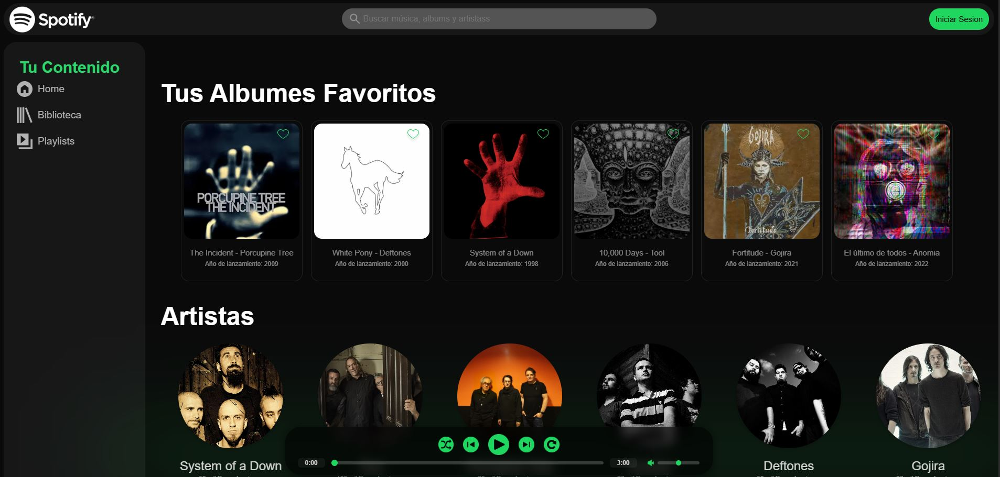
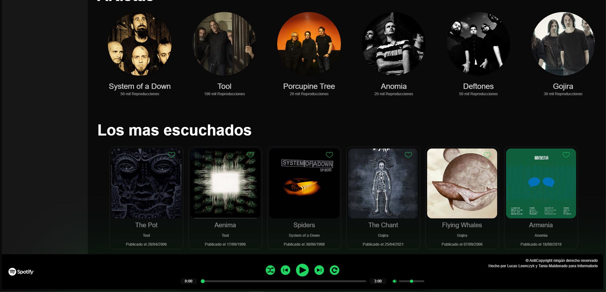

**♫ PROYECTO SPOTIFY CON REACT + VITE + TYPESCRIPT - ENTREGA 1**

**DESCRIPCIÓN:**

**Este proyecto es un clon simple de la interfaz de Spotify creado con Vite + React y TypeScript. La aplicación muestra una lista de álbumes favoritos, artistas y canciones mas escuchadas como muestra la captura de pantalla proporcionada.**

---

**Integrantes**

* Leonczyk, Lucas Miguel

* Maldonado, Tania Elizabeth

Profesor: Iván Sevilla 
  
---

**Estructura del proyecto**  
- Creado con [Vite](https://vite.dev/) + [React](https://react.dev/)
- TypeScript para tipado estático
- CSS Modules para estilos

---

**Componentes principales**  
1. **Encabezado:** Barra de navegación superior
2. **Sidebar:** Menú lateral con secciones de contenido
3. **SectionMusic:** Listado de álbumes favoritos (6 ítems)
4. **SectionMusicArtistas:** Listado de artistas (6 ítems)
5. **SectionMusicMasEscuchados:** Listado de canciones mas escuchadas (6 ítems)
6. **Barra de Reproducción** Reproductor de musica con varias opciones 
7. **Containers:** Componentes reutilizables para contenedores

---

**Requisitos cumplidos**
- Proyecto con Vite + React + TypeScript
- UI con componentes reutilizables (Sidebar y listas)
- Tres listados renderizados (Tus Albumes Favoritos, Artistas y Los Mas Escuchados)
- Tipado TypeScript para todas las estructuras de datos
- Estilos con CSS Modules
- Componente Container reutilizable que acepta children
- Cada ítem renderizado como componente individual

---

**Estructura de tipos**

 ```bash

type SectionMusic = {
  titulo: string;
  artista: string;
  año: string;
};

   ```

---

**Para poder ver el proyecto**  
Segír estos pasos para instalar npm y poder ejecutar el proyecto de manera local:

1. **Clonar el repositorio desde VSCode:**

```bash
git clone https://github.com/Lucas-1988/TP1-React.git
```

1. **Instalar** 
   
```bash
npm install
```

1. **Ejecutar**
   
```bash
npm run dev
```

---

**Capturas del proyecto**  

  
 


