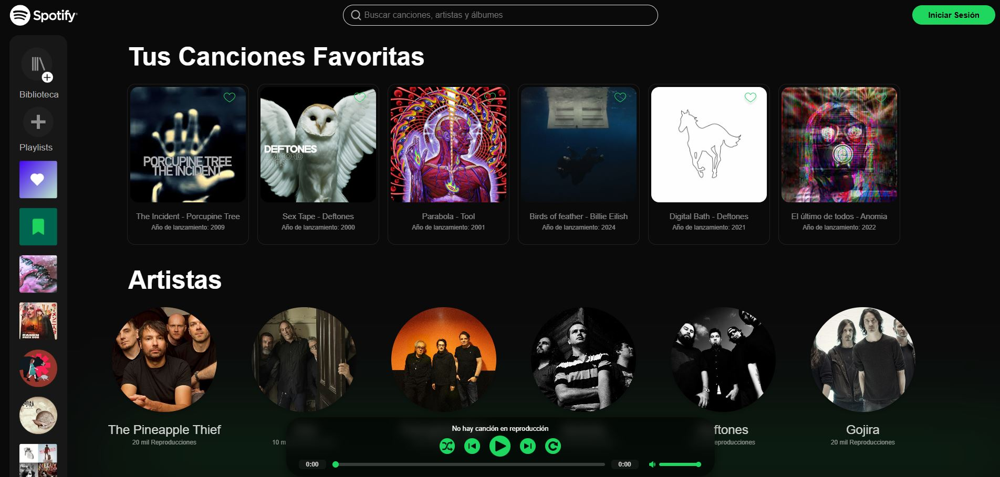
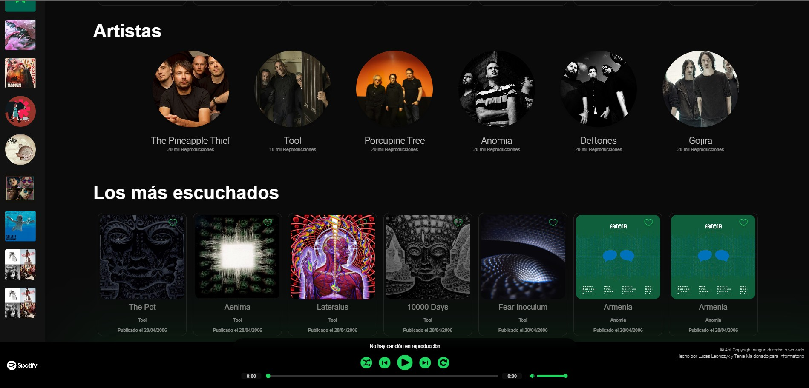

**♫ PROYECTO SPOTIFY CON REACT + VITE + TYPESCRIPT - ENTREGA 2**

**DESCRIPCIÓN:**

**Este proyecto es un clon simple de la interfaz de Spotify creado con Vite + React y TypeScript. La aplicación muestra una lista de álbumes favoritos, artistas y canciones mas escuchadas como muestra la captura de pantalla proporcionada.**

---

**Integrantes**

* Leonczyk, Lucas Miguel

* Maldonado, Tania Elizabeth


Profesor: Iván Sevilla
  

---

**Estructura del proyecto**  
- Creado con [Vite](https://vite.dev/) + [React](https://react.dev/)
- TypeScript para tipado estático
- CSS Modules para estilos

---

**Componentes principales**  
1. **Navbar:** Barra de navegación superior con fitro de busqueda de canciones
2. **Sidebar:** Menú lateral con secciones de contenido
3. **AlbumList:** Listado de álbumes favoritos (6 ítems)
4. **ArtistList:** Listado de artistas (6 ítems)
5. **Container:** Componente reutilizable para contenedores
5. **Barra de reproduccion:** Player fijo que muestra:
   - Reproducción en curso,
   - Botones de play, Pausa, Siguiente, Anterior, Aleatorio y Repetir,
   - Slider de avance y retroceso de la canción,
   - Slider de volúmen.


---

**Requisitos cumplidos en esta segunda entrega**
- Buscador de canciones con filtro por nombre
- Al hacer click en una canción el player muestra el nombre de la cancion y un botón de pausar y reproducir.
- El player está siempre visible.
- Slider para avanzar/retroceder la canción.

---

**Estructura de tipos**

 ```bash

type SectionMusic = {
  titulo: string;
  artista: string;
  año: string;
};

   ```

---

**Para poder ver el proyecto**  
Segí estos pasos para instalar npm y poder ejecutar el proyecto de manera local:

1. **Clonar el repositorio desde VSCode:**

```bash
git clone https://github.com/Lucas-1988/TP1-React.git
```

1. **Instalar** 
   
```bash
npm install
```

1. **Ejecutar**
   
```bash
npm run dev
```

---

**Link del video de recorrido del proyecto**

https://drive.google.com/file/d/1S4DeN1gJDCeUPvZKPgNjJWKxTtL7q-ps/view?usp=sharing

**Capturas de la interfaz**  

  



