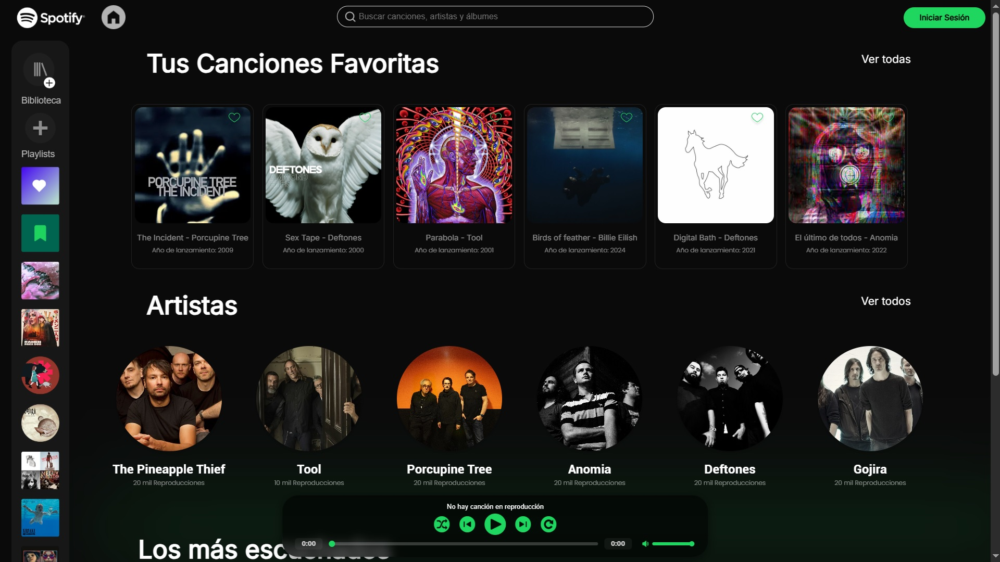
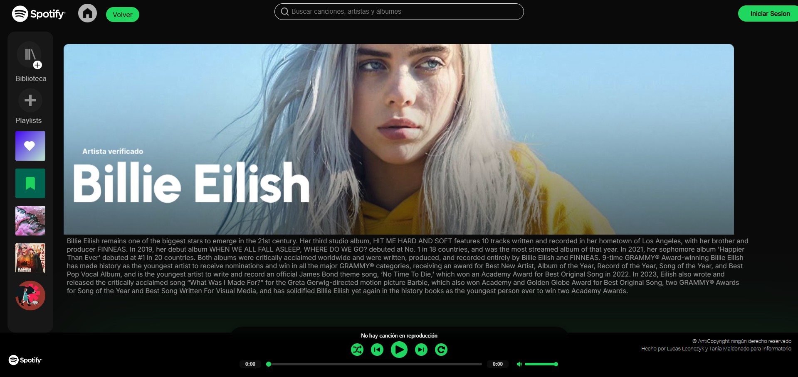
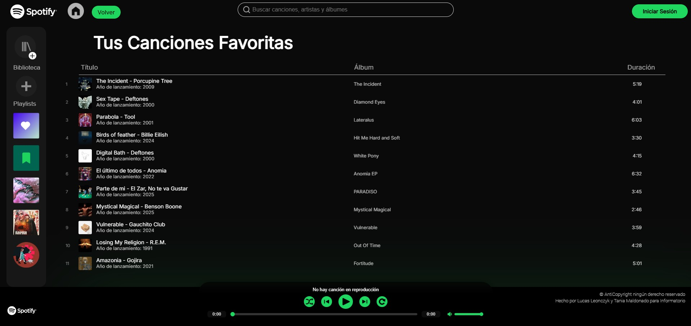

# 🎧 Entrega TP4 - React

## 🚀 PROYECTO SPOTIFY CON REACT + VITE + TYPESCRIPT - ENTREGA 3

Este proyecto corresponde al TP3 del curso de React, donde incorporamos *rutas* para navegar entre distintas vistas de una aplicación musical inspirada en Spotify.

---

## 🧩 Funcionalidades principales

- ✅ Página principal con listado de canciones (/)
- ✅ Página por categoría (/category/:id)
- ✅ Página de favoritas (/favoritos)
- ✅ Navegación entre rutas utilizando react-router-dom
- ✅ Componente Navbar para navegación global
- ✅ Estilo uniforme con fuente Inter

---

## 📸 Capturas de pantalla

> 📷 Ver en la descripción del Pull Request las imágenes y/o video de funcionamiento.

---

## 🧠 Tecnologías utilizadas

- React + Vite
- TypeScript
- React Router DOM
- CSS Modules
- @fontsource/inter (para tipografía personalizada)
  

---

## 🛠 Cómo correr el proyecto

1. Clonar el repositorio:
   bash
   git clone [https://github.com/usuario/Lucas-1988/TP1-React.git]
   

2. Instalar dependencias:
   bash
   npm install
   

3. Correr la app:
   bash
   npm run dev
   

---

## 🧑‍💻 Autores

- Lucas Leonczyk
- Tania Maldonado

---

## 📬 Entrega

- 🗂 Rama de entrega: TP3-React
- 🔀 Pull Request hacia main

**Link del video de recorrido del proyecto**

https://drive.google.com/file/d/18q7sE-5cwyyHVieJfQ3mGA4q3Daz8Jr7/view?usp=drive_link

**Capturas de la interfaz**  

  

